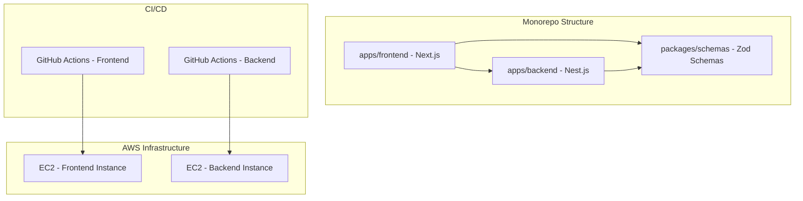

# Design Document

## Overview

This design outlines a proof-of-concept monorepo architecture featuring a Next.js frontend, Nest.js backend, and shared Zod validation schemas. The system implements a simple validation flow where users input "hello" to receive "world" as a response. The architecture emphasizes simplicity while demonstrating modern monorepo patterns and separate CI/CD deployment strategies to EC2 instances.

## Architecture

### High-Level Architecture



### Technology Stack

- **Monorepo Management**: pnpm workspaces with Turborepo for build orchestration
- **Frontend**: Next.js 15 with TypeScript and Turbopack (Node.js 22)
- **Backend**: Nest.js with TypeScript (Node.js 22)
- **Validation**: Zod schemas in shared package (Zod v4.1)
- **Containerization**: Docker for both frontend and backend
- **CI/CD**: GitHub Actions with Docker builds and Turbo caching
- **Deployment**: Docker containers on EC2 instances
- **Process Management**: Docker containers with restart policies

## Components and Interfaces

### Monorepo Structure

```
monorepo-poc/
├── apps/
│   ├── frontend/          # Next.js application
│   │   ├── Dockerfile
│   │   └── package.json
│   └── backend/           # Nest.js application
│       ├── Dockerfile
│       └── package.json
├── packages/
│   └── schemas/           # Shared Zod validation schemas
│       └── package.json
├── .github/
│   └── workflows/
│       ├── deploy-frontend.yml
│       └── deploy-backend.yml
├── docker-compose.yml     # Local development
├── turbo.json            # Turborepo configuration
├── pnpm-workspace.yaml   # pnpm workspace configuration
├── package.json          # Root package.json
└── README.md
```

### Shared Schemas Package

**Location**: `packages/schemas/`

**Purpose**: Centralized validation logic using Zod schemas (v4.1)

**Exports**:

- `HelloInputSchema`: Validates input equals "hello"
- `HelloResponseSchema`: Validates response structure
- Type definitions derived from schemas

**Dependencies**:

- Zod v4.1 for validation logic
- TypeScript for type definitions

### Frontend Application

**Framework**: Next.js 15 with App Router

**Key Components**:

- `HelloForm`: Input component with client-side validation
- `api/hello`: API route handler (optional for client-side validation demo)

**Validation Flow**:

1. User types in input field
2. Real-time validation using shared Zod schema
3. Submit button enabled only when valid
4. API call to backend on successful validation

### Backend Application

**Framework**: Nest.js with TypeScript

**Key Components**:

- `HelloController`: Handles POST /hello endpoint
- `HelloService`: Business logic for processing requests
- `ValidationPipe`: Global validation using Zod schemas

**API Endpoints**:

- `POST /hello`: Accepts input, validates, returns "world"

## Data Models

### Input Schema (Zod)

```typescript
import { z } from "zod";

export const HelloInputSchema = z.object({
	input: z.string().refine((val) => val === "hello", {
		message: "Input must be exactly 'hello'",
	}),
});

export type HelloInput = z.infer<typeof HelloInputSchema>;
```

### Response Schema (Zod)

```typescript
export const HelloResponseSchema = z.object({
	message: z.string(),
	success: z.boolean(),
});

export type HelloResponse = z.infer<typeof HelloResponseSchema>;
```

### API Contract

**Request**:

```json
{
	"input": "hello"
}
```

**Success Response** (200):

```json
{
	"message": "world",
	"success": true
}
```

**Error Response** (400):

```json
{
	"message": "Input must be exactly 'hello'",
	"success": false
}
```

## Error Handling

### Frontend Error Handling

- **Validation Errors**: Display inline error messages using Zod error formatting
- **Network Errors**: Show user-friendly error messages for API failures
- **Loading States**: Provide visual feedback during API calls

### Backend Error Handling

- **Validation Errors**: Return structured error responses with Zod validation messages
- **Global Exception Filter**: Catch and format all unhandled exceptions
- **Request Validation**: Use Nest.js ValidationPipe with Zod schemas

### Error Response Format

```typescript
interface ErrorResponse {
	success: false;
	message: string;
	errors?: Array<{
		field: string;
		message: string;
	}>;
}
```

## CI/CD Architecture

### GitHub Actions Strategy

**Two Separate Workflows**:

1. **Frontend Deployment** (`.github/workflows/deploy-frontend.yml`)

   - Triggers on changes to `apps/frontend/` or `packages/schemas/`
   - Uses Turborepo to build only affected packages with caching
   - Builds Docker image for Next.js application including shared schemas
   - Pushes image to AWS ECR (Elastic Container Registry)
   - Deploys container to frontend EC2 instance

2. **Backend Deployment** (`.github/workflows/deploy-backend.yml`)
   - Triggers on changes to `apps/backend/` or `packages/schemas/`
   - Uses Turborepo to build only affected packages with caching
   - Builds Docker image for Nest.js application including shared schemas
   - Pushes image to AWS ECR (Elastic Container Registry)
   - Deploys container to backend EC2 instance

### Deployment Strategy

**Docker-based EC2 Deployment**:

- Docker containers deployed to EC2 instances
- Docker Compose for container orchestration on each instance
- AWS ECR (Elastic Container Registry) for image storage
- Nginx as reverse proxy (frontend only)
- Environment-specific configuration via Docker environment variables
- IAM roles for EC2 instances to pull from ECR

### EC2 Instance Configuration

**Frontend Instance**:

- Docker runtime
- Docker Compose for container management
- Nginx for serving static files and reverse proxy
- Security group allowing HTTP/HTTPS traffic
- IAM role with ECR pull permissions

**Backend Instance**:

- Docker runtime
- Docker Compose for container management
- Security group allowing API traffic from frontend instance
- IAM role with ECR pull permissions

### AWS ECR Configuration

**Repository Setup**:

- Separate ECR repositories for frontend and backend images
- Repository naming: `monorepo-poc-frontend` and `monorepo-poc-backend`
- Lifecycle policies to manage image retention

**Authentication**:

- GitHub Actions uses AWS credentials to push images
- EC2 instances use IAM roles to pull images
- ECR login tokens for Docker authentication

## Docker Configuration

### Frontend Dockerfile

**Multi-stage build approach**:

1. **Build stage**: Install pnpm, copy workspace files, install dependencies, and build Next.js application with Turbopack
2. **Production stage**: Copy built application and serve with minimal Node.js runtime

**Key considerations**:

- Use pnpm for efficient dependency management
- Include shared schemas package in the build through workspace dependencies
- Leverage Turbopack for faster builds
- Optimize for production with minimal image size
- Use Node.js 22 Alpine base image for security and size

### Backend Dockerfile

**Multi-stage build approach**:

1. **Build stage**: Install pnpm, copy workspace files, install dependencies, and build Nest.js application
2. **Production stage**: Copy built application with minimal Node.js runtime

**Key considerations**:

- Use pnpm for efficient dependency management
- Include shared schemas package in the build through workspace dependencies
- Leverage Turborepo for optimized builds
- Expose appropriate port for API access
- Use Node.js 22 Alpine base image for security and size

### Turborepo Configuration

**Build Pipeline**:

- `build`: Builds all applications and packages
- `dev`: Runs development servers for all applications
- `lint`: Lints all packages
- `test`: Runs Vitest tests for all packages

**Caching Strategy**:

- Remote caching for CI/CD performance
- Task dependencies to ensure proper build order
- Incremental builds based on file changes

**Pipeline Dependencies**:

- Frontend build depends on schemas package build
- Backend build depends on schemas package build
- Ensures shared schemas are built before applications

### Docker Compose

**Local Development**:

- Frontend service on port 3000
- Backend service on port 3001
- Shared network for inter-service communication
- Volume mounts for development hot-reload

**Production Deployment**:

- Environment-specific configurations
- Health checks for both services
- Restart policies for reliability

## Testing Strategy

### Unit Testing

**Shared Schemas**:

- Test all validation scenarios
- Test type inference correctness
- Test error message formatting

**Frontend**:

- Component testing with React Testing Library
- Form validation testing
- API integration testing

**Backend**:

- Controller unit tests
- Service unit tests
- Validation pipe testing

### Integration Testing

**API Integration**:

- End-to-end API testing
- Request/response validation
- Error handling scenarios

**Deployment Testing**:

- Smoke tests after deployment
- Health check endpoints
- Cross-service communication validation

### Testing Tools

- **Vitest**: Unit and integration testing (faster alternative to Jest)
- **React Testing Library**: Frontend component testing
- **Supertest**: Backend API testing
- **GitHub Actions**: Automated testing in CI pipeline

## Security Considerations

### Input Validation

- Strict validation using Zod schemas
- No direct database queries (not applicable for this POC)
- Request size limiting

### Deployment Security

- EC2 security groups with minimal required access
- SSH key-based authentication for deployments
- Environment variables for sensitive configuration
- HTTPS termination at load balancer level (future enhancement)

### CORS Configuration

- Configure CORS to allow frontend domain only
- Restrict allowed methods and headers
- Environment-specific CORS settings

## Performance Considerations

### Monorepo Optimization

- Workspace dependency hoisting
- Shared build cache (future: Turborepo integration)
- Selective deployment based on changed packages

### Application Performance

- Next.js static optimization where possible
- Nest.js response caching for validation results
- Minimal bundle sizes through tree shaking

### Deployment Performance

- Parallel deployment workflows
- Incremental builds where possible
- PM2 zero-downtime restarts
